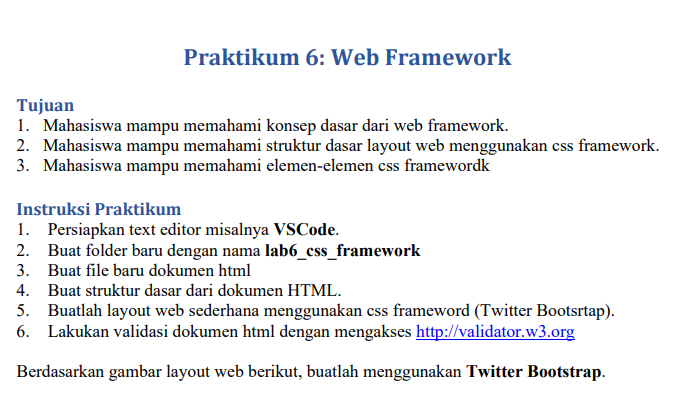
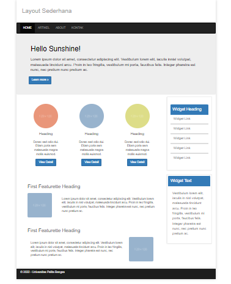

# Web6Lab6

**Nama    : Aning Kinanti** <br>
**NIM     : 312010364** <br>
**Kelas   : TI.20.A2** <br>
**Matkul  : Pemrograman Web** <br>

# Belajar Web FrameWork

## A. Instruksi Praktikum

<br>

 <br>

### 1. SYNTAX HTML
Berikut adalah syntax html untuk membuat tampilan web sederhana dengan menggunakan framework bootstrap. <br>
Buatlah file html dengan nama `lab6_css_framework.html`. <br>

```
<!DOCTYPE html>
<html lang="en">
<head>
    <meta charset="UTF-8">
    <meta http-equiv="X-UA-Compatible" content="IE=edge">
    <meta name="viewport" content="width=device-width, initial-scale=1.0">
    <title>CSS FRAMEWORK</title>

    <!-- bootstrap -->
    <link href="css/bootstrap.min.css" rel="stylesheet">
    <link href="css/style.css" rel="stylesheet">

    <!-- HTML5 shim and respon.js for IE8 support of HTML5 elements and
    media queries -->
    <!-- WARNING: Respon.js doesn't wor if you view the page via
    file:// -->
    <!--[if lt IE 9]>
        <script src="https://oss.maxcdn.com/html5shiv/3.7.3/html5shiv.min.js"></script>
        <script src="https://oss.maxcdn.com/respond/1.4.2/respond.min.js"></script>
    <![endif]-->
</head>
<body>
  <div class="container">
    <div class="page-header">
      <h1>Layout Sederhana</h1>
    </div>
    <!-- navbar -->
    <nav class="navbar navbar-inverse">
      <div class="container-fluid">
        <ul class="nav navbar-nav">
          <li class="active"><a href="#">HOME</a></li>
          <li><a href="#">ARTIKEL</a></li>
          <li><a href="#">ABOUT</a></li>
          <li><a href="#">KONTAK</a></li>
        </ul>
      </div>
    </nav>

    <!-- Jumbotron -->
    <div class="jumbotron">
      <h1>Hello Sunshine!</h1>
      <p>Lorem ipsum dolor sit amet, consectetur adipiscing elit. Vestibulum lorem 
          elit, iaculis innisl volutpat, malesuada tincidunt arcu. Proin in leo fringilla, 
          vestibulum mi porta, faucibus felis. Integer pharetra est nunc, nec pretium nunc 
          pretium ac.</p>
      <a href="home.html" class="btn btn-primary"> Learn more &raquo;</a>
    </div>

    <!-- card -->
    <div class="row">
      <div class="col-sm-8">
        <div class="row">
          <div class="col-sm-4">
            <div class="card text-center" style="width: 18rem;">
              
              <div class="card-body">
                <h4 class="card-title text-center">Heading</h4>
                <p class="card-text text-center">Donec sed odio dui. Etiam porta sem malesuada magna mollis 
                  euismod.</p>
                <a href="#" class="btn btn-primary ">View Detail</a>
              </div>
            </div>
          </div>
          <div class="col-sm-4">
            <div class="card text-center" style="width: 18rem;">
              
              <div class="card-body">
                <h4 class="card-title text-center">Heading</h4>
                <p class="card-text text-center">Donec sed odio dui. Etiam porta sem malesuada magna mollis 
                  euismod.</p>
                <a href="#" class="btn btn-primary">View Detail</a>
              </div>
            </div>
          </div>
          <div class="col-sm-4">
            <div class="card text-center" style="width: 18rem;">
              
              <div class="card-body">
                <h4 class="card-title text-center">Heading</h4>
                <p class="card-text text-center">Donec sed odio dui. Etiam porta sem malesuada magna mollis 
                  euismod.</p>
                <a href="#" class="btn btn-primary ">View Detail</a>
              </div>
            </div>
          </div>
        </div>

        <!-- card 2 -->
        <div class="row">
          <div class="card mb-3" style="max-width: 700px; max-height: 150px;">
            <h3 class="card-title" style="margin-bottom: 15px;">First Featurette Heading</h3>
            <div class="row g-0">
              <div class="col-md-3">
                
              </div>
              <div class="col-md-9">
                <div class="card-body">
                  <p class="card-text">Lorem ipsum dolor sit amet, consectetur adipiscing elit. Vestibulum lorem 
                    elit, iaculis in nisl volutpat, malesuada tincidunt arcu. Proin in leo fringilla, 
                    vestibulum mi porta, faucibus felis. Integer pharetra est nunc, nec pretium nunc 
                    pretium ac.</p>                  
                </div>
              </div>
            </div>
          </div>
        </div>
        <div class="row">
          <div class="card mb-3" style="max-width: 700px; max-height: 300px;">
            <h3 class="card-title" style="margin-bottom: 15px;">First Featurette Heading</h3>
              <div class="col-md-9">
                <div class="card-body">
                  <p class="card-text">Lorem ipsum dolor sit amet, consectetur adipiscing elit. Vestibulum lorem 
                    elit, iaculis in nisl volutpat, malesuada tincidunt arcu. Proin in leo fringilla, 
                    vestibulum mi porta, faucibus felis. Integer pharetra est nunc, nec pretium nunc 
                    pretium ac.</p>                  
                </div>
              </div>
              <div class="row g-0">
                <div class="col-md-3">
                  
                </div>
            </div>
          </div>
        </div>
      </div>
      
      <!-- panel -->
      <div class="col-sm-3">
        <div class="panel panel-primary">
          <div class="panel-heading">Widget Heading</div>
            <div class="list-group">
              <a href="#" class="list-group-item">Widget Link</a>
              <a href="#" class="list-group-item">Widget Link</a>
              <a href="#" class="list-group-item">Widget Link</a>
              <a href="#" class="list-group-item">Widget Link</a>
              <a href="#" class="list-group-item">Widget Link</a>
            </div>
          </div>
          <div class="panel panel-primary" style="padding: 5px;">
            <div class="panel-heading">Widget Text</div>
            <div class="panel-body">
              <p>Vestibulum lorem elit, iaculis in nisl volutpat, malesuada tincidunt 
                arcu. Proin in leo fringilla, vestibulum mi porta, faucibus felis. Integer 
                pharetra est nunc, nec pretium nunc pretium ac.</p>
            </div>
          </div>
        </div>
      </div>
    </div>
    <div class="container">
      <footer>
        <p>&copy; 2022 - Universitas Pelita Bangsa</p>
      </footer>
    </div>
  </div>
    
    <!-- jQuery (necessary fot Bootstrap's JavaScript plugins) -->
    <script src="js/jquery-3.1.1.min.js"></script>

    <!-- Include all compiled plugins (below), or include individual
    files as needed -->
    <script src="js.bootstrap.min.js"></script>
</body>
</html>
```
<br>

### 2. SYNTAX CSS
Berikut adalah syntax css untuk membuat memnambahkan beberapa atribut. <br>
Buatlah file css dengan nama `style.css` dengan isi seperti dibawah ini : <br>

```
/* CONTAINER */
.container {
  width: 980px;
  margin: 0 auto;
  box-shadow: 0 0 1em #ccc;
  padding: 0;
}

/* NAVBAR */
.navbar {
  margin-bottom: 0%;
}

/* PAGE-HEADER */
.page-header {
  padding: 17px;
  margin: 0px 0px;
}

.page-header h1 {
  margin: 20px 10px;
  color: #a0a0a0;
  font-size: 30px;
}

/* JUMBOTRON */
.jumbotron {
  padding: 50px 20px;
  margin-bottom: 10px;
}

.jumbotron h1 {
  margin: 5px 5px;
  color: #000;
  font-size: 35px;
  padding-left: 5px;
}

.jumbotron p {
  margin: 5px 5px;
  color: #000;
  font-size: 18px;
  padding-left: 5px;
  padding-top: 15px;
  padding-bottom: 15px;
}

/* PANEL */
.panel {
  border: 1px solid #eee;
  margin-bottom: 20px;
  padding: 35px 15px;
}

.panel-heading {
  padding: 10px 10px;
  color: #fff;
  font-size: 20px;
}

.panel list-style:hover a {
  background-color: #eee;
}

.panel-body p {
  padding: 5px;
  line-height: 25px;
  font-size: 16px;
}

.list-group a {
font-size: 16px;
}

/* CARD */
.card {
  padding: 35px 15px;
}

.card-body h4 {
  margin-top: 20px;
}

.card-body p {
  margin-top: 20px;
}

/* COL */
.col-sm-3 {
  margin-right: 10px;
  margin-left: 10px;
}

.col-sm-8 {
  margin-left: 55px;
}

.col-md-8 p {
  line-height: 25px;
  padding: 0;
  margin: 0 auto;
}

/* FOOTER */
.container footer {
  padding-top: 10px;
  padding-bottom: 10px;
}

footer {
  clear: both;
  background-color: #1d1d1d;
  padding: 20px;
  color: #eee;
}
```
<br>

### 3. OUTPUT
Berikut adalah hasil dari syntax diatas : <br>

 <br>


